# Fashion Magazine Poster Generator

一个面向 Codex 的高审美时尚杂志海报生成 skill。它可以从人物照片、产品图、场景照片或文字 brief 中提取视觉特征，重新设计成 fashion magazine cover、editorial poster、lookbook、campaign page、color board 或成套海报，并输出可直接用于即梦的中文提示词。

## What it does

- 反推参考图的布局、色彩、字体、图像关系、人物动作、神态、光影和色调
- 根据人物的气质、服装、姿态与场景动态生成标题、栏目字、短文案和中英混排文字
- 提供 13 个细分风格，并要求每次生成切换构图、字体系统、色彩策略、文字密度和摄影语言
- 支持单张海报、杂志封面、lookbook、campaign、四宫格/多张成套海报
- 支持碎片编辑路线：F1 证据墙、F2 贴纸手册、F3 档案索引、F4 叙事拼贴
- 支持“先选风格，再生成”的两阶段流程，也支持直接进入生成
- 提供即梦（Jimeng）prompt mode、质量检查和防止模板重复的 variation director

## 13 style families

1. Street Editorial — 城市街头编辑感
2. Quiet Luxury — 安静奢华
3. Retro French — 复古法式
4. Y2K Digital — Y2K 数码时尚
5. Y2K Cyber-Kawaii Idol Scrapbook — 赛博可爱偶像手账拼贴
6. Gothic Romantic — 哥特浪漫
7. Japanese Minimal — 日式极简
8. Art-school Collage — 艺术院校拼贴
9. Futuristic Technical — 未来技术风
10. Sports Couture — 运动高定
11. Surreal Color-block — 超现实色块
12. Documentary Runway — 纪录片式秀场
13. Typography-first — 字体主导海报

## Install

将仓库内容复制到 Codex 的 skill 目录：

```powershell
Copy-Item -Recurse -Force . "C:\Users\你的用户名\.codex\skills\fashion-magazine-poster-generator"
```

安装后，在 Codex 中使用：

```text
$fashion-magazine-poster-generator
```

## Example requests

```text
请先分析这张参考图，再给我 3 个完全不同的海报风格候选。
根据这张人物照片生成一张很潮流、很 fashion 的杂志海报。
换一种风格，标题和字体排版也要一起变化。
生成一组成套海报，放在一张图上，保持人物识别一致但每张版式不同。
输出适合即梦生成的最终提示词。
```

## Case gallery

以下案例使用同一套 skill 的 13 个风格分支生成，包含人物动作、神态、光影、色调、版式和动态标题的变化。

| Style | Title | Preview |
|---|---|---|
| Street Editorial | CITY AFTERIMAGE | 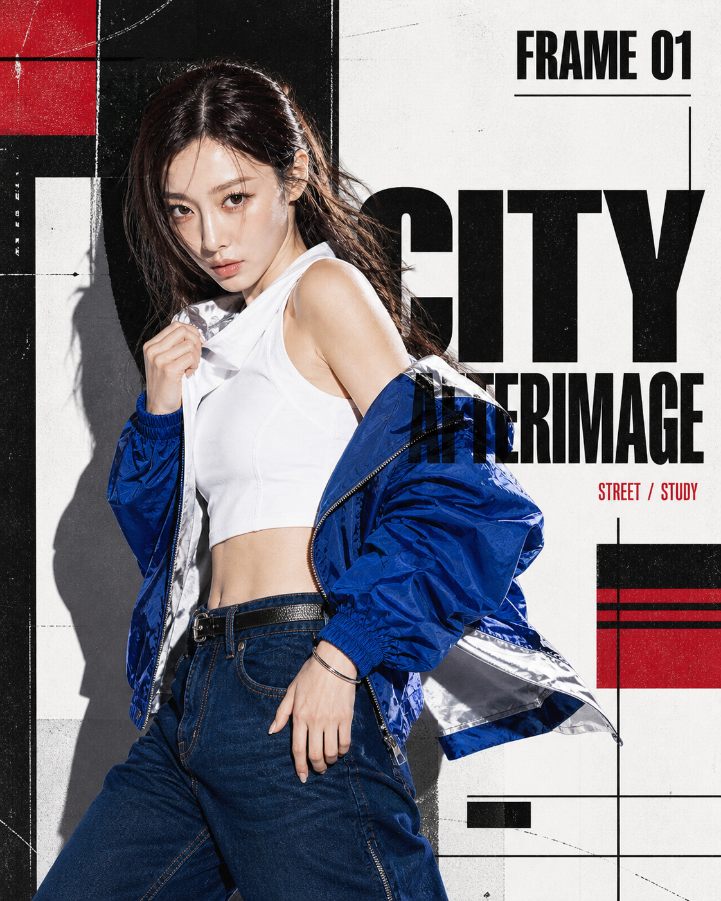 |
| Quiet Luxury | SOFT STRUCTURE | 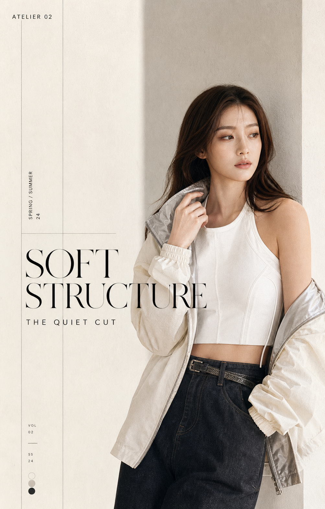 |
| Retro French | CHAMBRE CLAIRE | 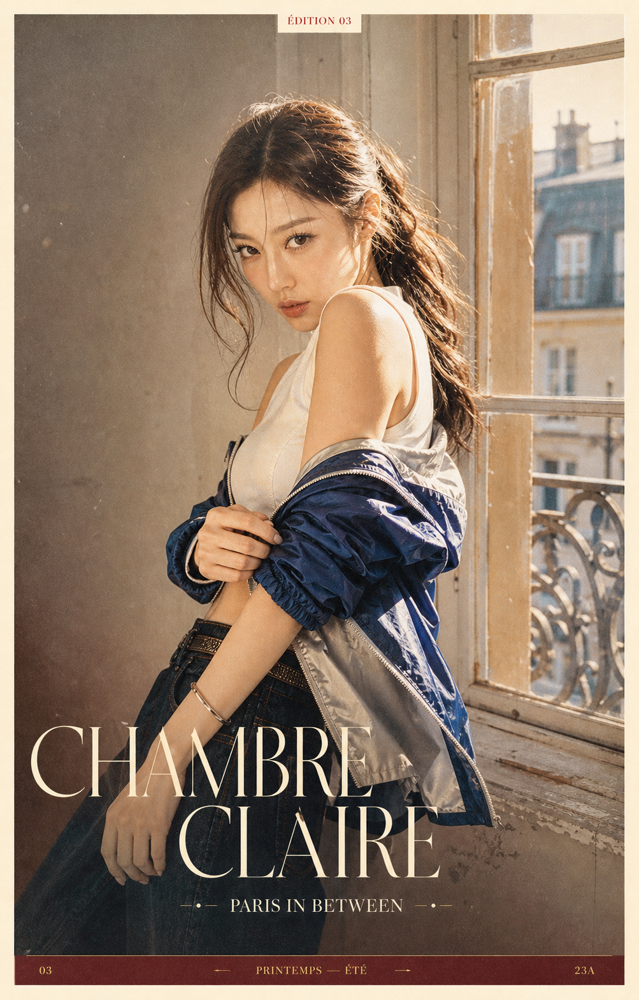 |
| Y2K Digital | GLOW MODE | 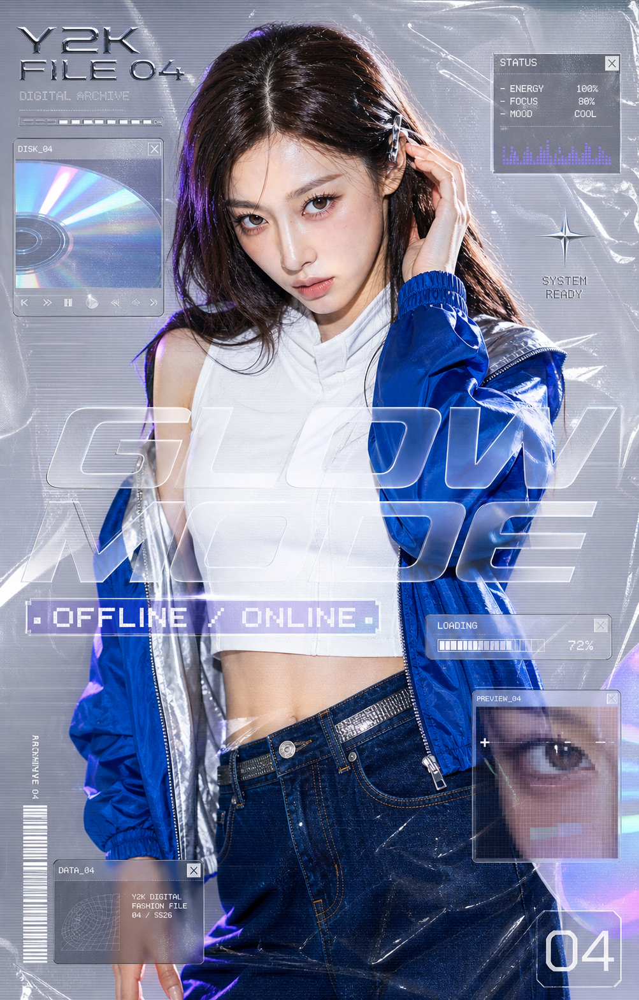 |
| Y2K Cyber-Kawaii Idol Scrapbook | ホーム / IDOL FILE | 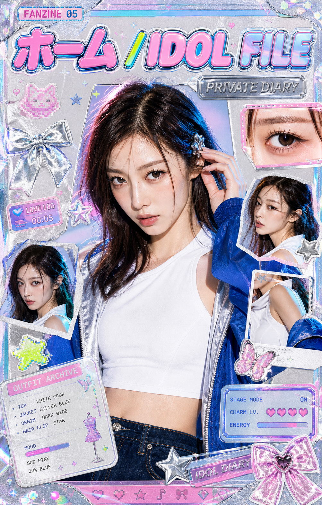 |
| Gothic Romantic | VELVET STATIC | 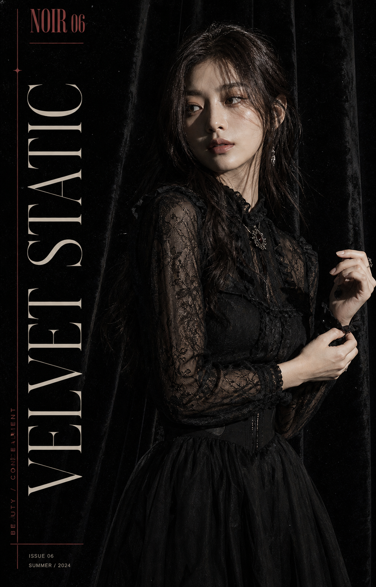 |
| Japanese Minimal | STILL HERE | 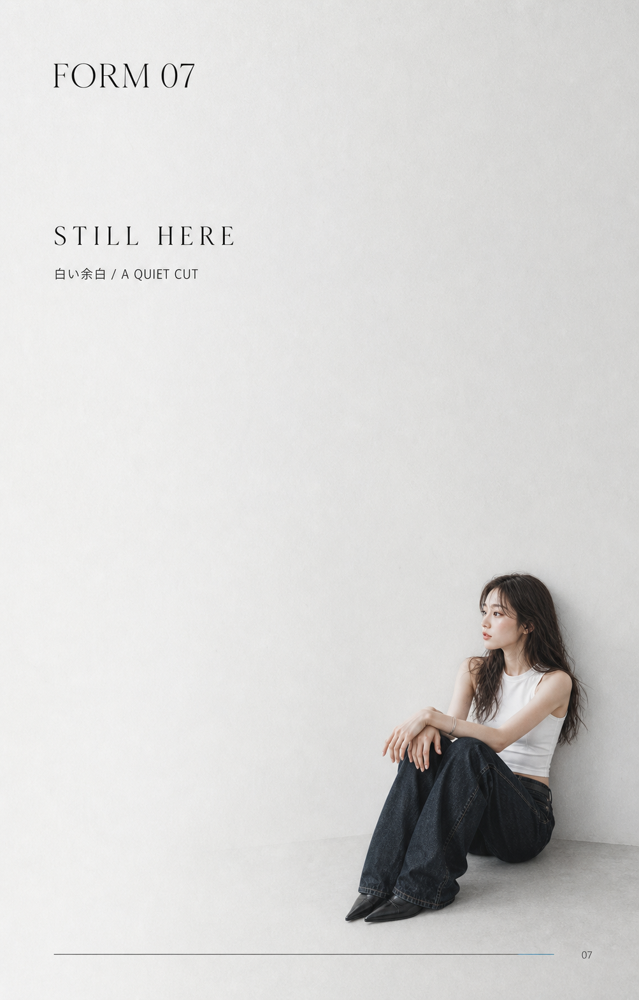 |
| Art-school Collage | CUT / KEEP | 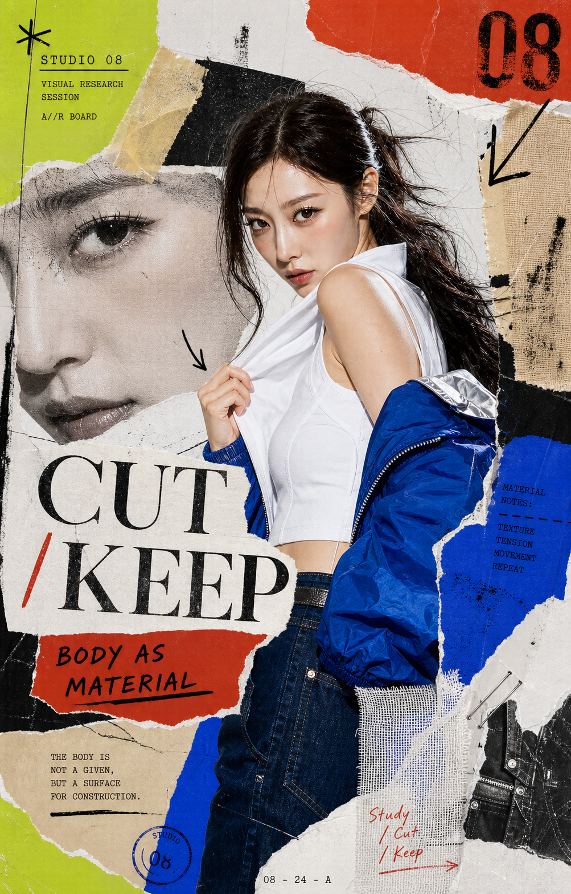 |
| Futuristic Technical | SKIN PROTOCOL | 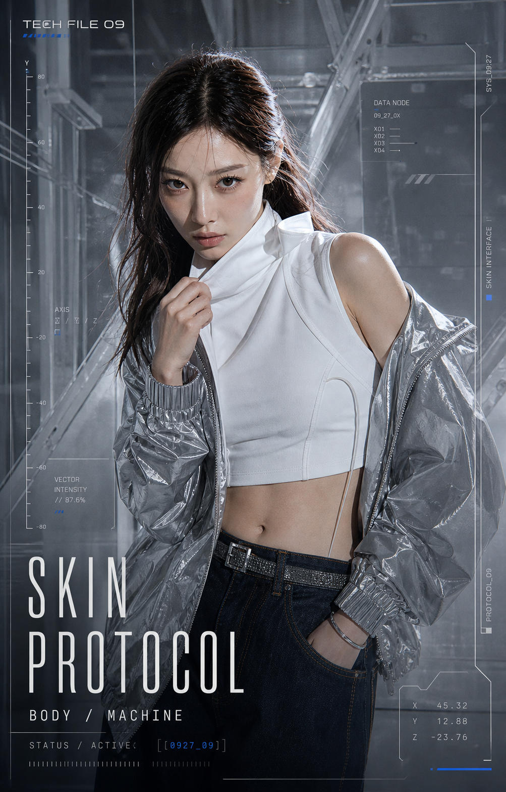 |
| Sports Couture | FORWARD PRESSURE | 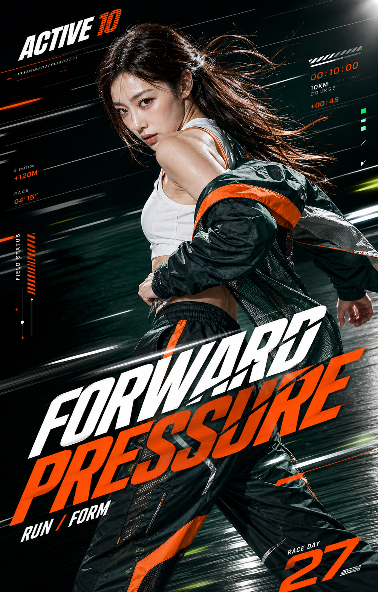 |
| Surreal Color-block | SHIFTED FORM | 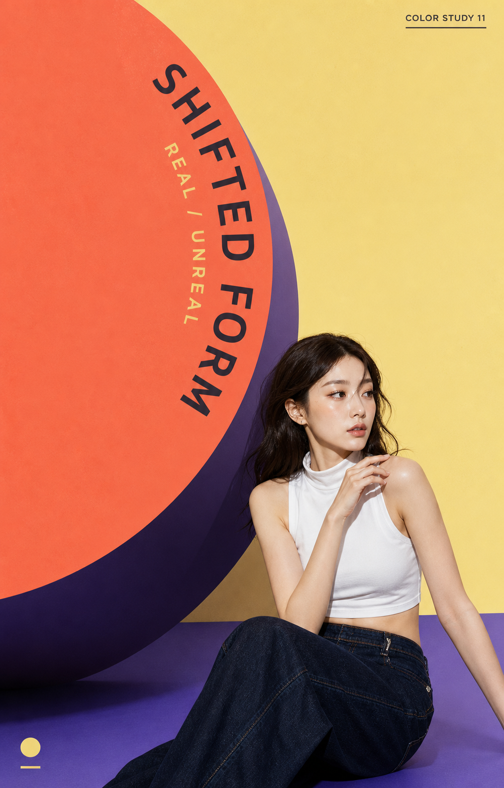 |
| Documentary Runway | BACKSTAGE / 17 | 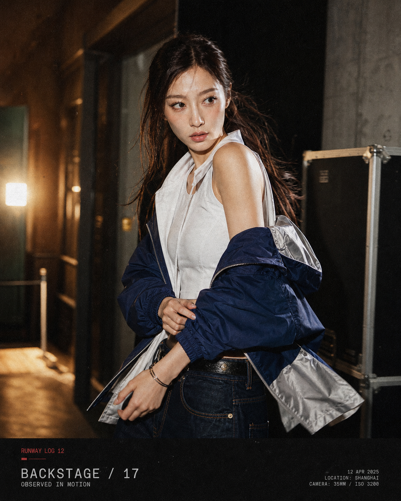 |
| Typography-first | FORM / FLASH | 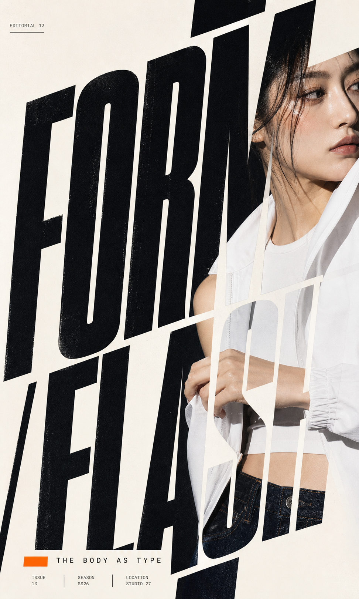 |

## Repository structure

```text
.
├── SKILL.md
├── agents/
├── references/
├── scripts/
├── examples/
│   └── images/       # 13 style case images
└── README.md
```

## Notes

案例图片用于展示 skill 的视觉方向和版式能力；生成时应根据当前参考图重新提取特征，不要机械复制案例。涉及品牌 logo、现成商标或具体杂志名称时，建议改为原创文字。即梦对复杂文字的准确率可能有波动，正式商业交付可在生成后用排版软件替换或修正文字。

## License

本仓库暂未声明开源许可证。发布到公开仓库前，请根据你的使用和分发计划补充合适的 License。
